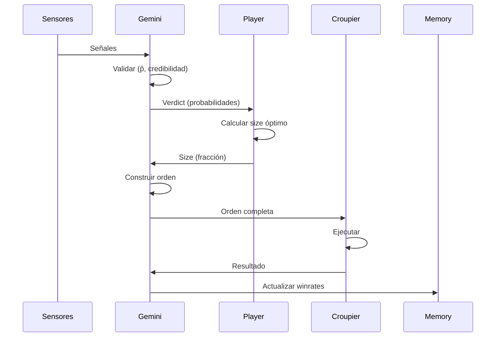

# 🧠 Arquitectura Gemini/Player

Explicación detallada de la separación de responsabilidades entre Gemini (validación) y Players (sizing).

---

## 🎯 Separación de Responsabilidades

### Problema Original (v0.1.0)

Gemini hacía **TODO**:
- ✅ Validar señales
- ✅ Calcular probabilidades
- ✅ Calcular Kelly
- ✅ Construir orden

**Problema:** Imposible experimentar con diferentes estrategias de sizing sin modificar Gemini.

### Solución (v0.1.2)

**Gemini:** Validación probabilística
**Player:** Estrategia de sizing
**Gemini:** Construcción de orden

```python
# Gemini valida
verdict = gemini.evaluate_signals_v2(signals, equity)

# Player decide tamaño
size = player.calculate_position_size(verdict, equity)

# Gemini construye orden
order = gemini.make_order_from_verdict(verdict, size)
```

---

## 📊 Flujo Detallado



---

## 🎩 Gemini: Validador Probabilístico

### Responsabilidades

1. **Validar señales:** ¿Son coherentes?
2. **Calcular p̂:** Winrate por estrategia
3. **Calcular credibilidad:** ¿Hay suficientes datos?
4. **Emitir Verdict:** Información para el Player

### NO hace

- ❌ Decidir tamaño de posición
- ❌ Aplicar Kelly u otra fórmula de sizing

### API Principal

#### `evaluate_signals_v2()`

```python
def evaluate_signals_v2(
    signals: List[dict], 
    equity: float
) -> Verdict:
    """
    Valida señales y retorna Verdict.
    
    Returns:
        Verdict con:
        - side: "LONG" | "SHORT" | None
        - metrics: Lista de ParticipantMetrics
        - reason: Por qué se tomó la decisión
    """
```

#### `make_order_from_verdict()`

```python
def make_order_from_verdict(
    verdict: Verdict,
    size_fraction: float,
    ghost: bool = False
) -> dict:
    """
    Construye orden desde Verdict + tamaño del Player.
    """
```

### Verdict

```python
@dataclass
class Verdict:
    trade_id: Optional[str]
    side: Optional[str]              # "LONG" | "SHORT" | None
    reason: str
    metrics: List[ParticipantMetrics]
    participants: List[Participant]
    meta: Dict
```

### ParticipantMetrics

```python
@dataclass
class ParticipantMetrics:
    participant: Participant
    support: int                      # Trades en ventana
    p_hat: Optional[float]            # Winrate observado
    credibility: float                # Pr(p > p*)
    p_conservative: float             # Percentil 10%
    kelly: float                      # Kelly calculado (referencia)
    approved: bool                    # Tiene suficiente soporte
    reason: str
```

---

## 🎮 Player: Estratega de Sizing

### Responsabilidades

1. **Recibir Verdict:** Analizar métricas
2. **Decidir tamaño:** Aplicar estrategia de sizing
3. **Retornar fracción:** [0.0, 1.0] o None

### NO hace

- ❌ Validar señales
- ❌ Calcular probabilidades
- ❌ Construir órdenes

### API

```python
def calculate_position_size(
    verdict: Verdict,
    equity: float,
    meta: Optional[dict] = None
) -> Optional[float]:
    """
    Calcula tamaño de posición óptimo.
    
    Args:
        verdict: Veredicto de Gemini
        equity: Capital disponible
        meta: Metadata adicional (opcional)
    
    Returns:
        float: Fracción [0.0, 1.0] o None si no apostar
    """
```

---

## 🔬 Players Disponibles

### 1. Kelly Player

**Estrategia:** Kelly Criterion conservador

```python
# players/kelly_player.py

def calculate_position_size(verdict, equity, meta=None):
    if not verdict or not verdict.side:
        return None
    
    # Filtrar aprobados
    approved = [m for m in verdict.metrics if m.approved]
    if not approved:
        return None
    
    # Tomar Kelly mínimo (conservador)
    positive_kelly = [m.kelly for m in approved if m.kelly > 0]
    if not positive_kelly:
        return None
    
    min_kelly = min(positive_kelly)
    return min(min_kelly * KELLY_FRACTION, MAX_POSITION_SIZE)
```

**Ventajas:**
- ✅ Teóricamente óptimo
- ✅ Se ajusta al edge
- ✅ Conservador (20% del óptimo)

**Desventajas:**
- ⚠️ Sensible a errores de estimación
- ⚠️ Puede ser agresivo si mal calibrado

---

### 2. Fixed Player

**Estrategia:** Tamaño fijo siempre

```python
# players/fixed_player.py

def calculate_position_size(verdict, equity, meta=None):
    if not verdict or not verdict.side:
        return None
    
    # Verificar que hay estrategias aprobadas
    approved = [m for m in verdict.metrics if m.approved]
    if not approved:
        return None
    
    # Verificar que hay edge positivo
    positive_edge = any(m.kelly > 0 for m in approved)
    if not positive_edge:
        return None
    
    return FIXED_POSITION_SIZE  # 1% por defecto
```

**Ventajas:**
- ✅ Muy simple
- ✅ Predecible
- ✅ No depende de estimaciones

**Desventajas:**
- ⚠️ No se ajusta al edge
- ⚠️ Puede sub-aprovechar o sobre-arriesgar

---

## 🆚 Comparación Kelly vs Fixed

| Aspecto | Kelly | Fixed |
|---------|-------|-------|
| **Complejidad** | Media | Baja |
| **Adaptabilidad** | Alta | Nula |
| **Sensibilidad** | Alta | Baja |
| **Riesgo** | Variable | Constante |
| **Performance** | Mejor (teoría) | Estable |

---

## 🛠️ Crear Custom Player

### Template Mínimo

```python
# players/my_player.py

def calculate_position_size(verdict, equity, meta=None):
    """
    Tu estrategia personalizada.
    
    Args:
        verdict: Verdict de Gemini
        equity: Capital disponible
        meta: Dict con info adicional (opcional)
    
    Returns:
        float [0, 1] o None
    """
    # 1. Validar entrada
    if not verdict or not verdict.side:
        return None
    
    # 2. Filtrar métricas aprobadas
    approved = [m for m in verdict.metrics if m.approved]
    if not approved:
        return None
    
    # 3. Tu lógica aquí
    # Ejemplo: usar p_hat promedio
    avg_p_hat = sum(m.p_hat for m in approved) / len(approved)
    
    if avg_p_hat > 0.55:
        return 0.02  # 2%
    elif avg_p_hat > 0.53:
        return 0.01  # 1%
    else:
        return None  # No apostar
```

### Ejemplo: Adaptive Player

```python
# players/adaptive_player.py
import config

def calculate_position_size(verdict, equity, meta=None):
    """
    Ajusta Kelly según volatilidad del mercado.
    """
    if not verdict or not verdict.side:
        return None
    
    approved = [m for m in verdict.metrics if m.approved]
    if not approved:
        return None
    
    # Kelly base (como Kelly Player)
    positive_kelly = [m.kelly for m in approved if m.kelly > 0]
    if not positive_kelly:
        return None
    
    min_kelly = min(positive_kelly)
    
    # Ajustar por volatilidad (ejemplo)
    volatility = meta.get("volatility", 0.02) if meta else 0.02
    
    # Si volatilidad alta → reducir size
    if volatility > 0.03:
        adjustment = 0.5
    elif volatility > 0.02:
        adjustment = 0.75
    else:
        adjustment = 1.0
    
    adjusted_kelly = min_kelly * config.KELLY_FRACTION * adjustment
    return min(adjusted_kelly, config.MAX_POSITION_SIZE)
```

Ver [Creating Players Guide](../guides/creating-players.md) para más ejemplos.

---

## 📊 Ventajas de la Arquitectura

### 1. Modularidad

```python
# Cambiar de player es trivial
from players import kelly_player as player
# vs
from players import fixed_player as player
```

### 2. Testing Independiente

```python
# Test Gemini (validación)
verdict = gemini.evaluate_signals_v2(signals, 10000)
assert verdict.side == "LONG"
assert len(verdict.metrics) == 2

# Test Player (sizing)
size = player.calculate_position_size(verdict, 10000)
assert 0.0 <= size <= 0.02
```

### 3. Experimentación

```bash
# Comparar players
python main.py --player=kelly
python main.py --player=fixed
python main.py --player=adaptive
```

### 4. Extensibilidad

Agregar player nuevo:
1. Crear `players/my_player.py`
2. Implementar `calculate_position_size()`
3. Usar: `python main.py --player=my_player`

**No modificar Gemini ni otros componentes.**

---

## 🔄 Compatibilidad Legacy

Para mantener compatibilidad, Gemini aún tiene `evaluate_signals()`:

```python
# API Legacy (v0.1.0) - sigue funcionando
decision = gemini.evaluate_signals(signals, equity)
# Decision con orden ya construida (Kelly integrado)

# API Nueva (v0.1.2)
verdict = gemini.evaluate_signals_v2(signals, equity)
size = player.calculate_position_size(verdict, equity)
order = gemini.make_order_from_verdict(verdict, size)
```

**Recomendación:** Usar API nueva para nuevos desarrollos.

---

## 🎯 Best Practices

### 1. Player debe ser puro

```python
# ✅ BIEN: Sin estado interno
def calculate_position_size(verdict, equity, meta):
    return 0.01 if has_edge(verdict) else None

# ❌ MAL: Con estado mutable
class MyPlayer:
    def __init__(self):
        self.last_size = 0.0  # Estado mutable
    
    def calculate(self, verdict, equity):
        self.last_size = 0.01  # Modifica estado
        return self.last_size
```

### 2. Validar entrada

```python
def calculate_position_size(verdict, equity, meta=None):
    # Validar
    if not verdict or not verdict.side:
        return None
    
    if equity <= 0:
        return None
    
    # Tu lógica aquí
    ...
```

### 3. Respetar límites

```python
# Siempre respetar MAX_POSITION_SIZE
size = calculate_my_size(verdict)
return min(size, config.MAX_POSITION_SIZE)
```

### 4. Documentar decisiones

```python
def calculate_position_size(verdict, equity, meta=None):
    """
    Estrategia: Kelly conservador con ajuste por volatilidad.
    
    Lógica:
    - Toma Kelly mínimo entre aprobados
    - Reduce 50% si volatilidad > 3%
    - Máximo 2% siempre
    
    Returns:
        float o None
    """
```

---

## 📈 Roadmap

### Próximos Players

1. **Adaptive Player** - Ajusta por volatilidad
2. **Regime Player** - Cambia según bull/bear
3. **Ensemble Player** - Combina múltiples estrategias
4. **ML Player** - Usa modelo entrenado

### Features Futuras

- Multi-player mode (comparar en paralelo)
- Player optimization (backtesting masivo)
- Player tournaments (competencia)

---

**← [Volver al índice](../README.md)**
