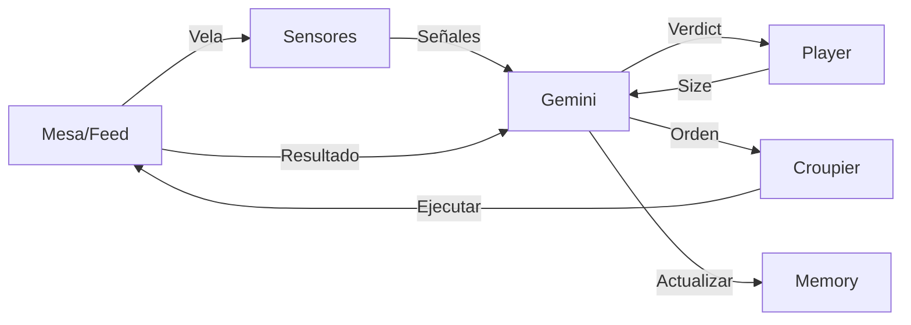

# 🏗️ Arquitectura - Overview

## 🎯 Visión General del Sistema

**Casino V2 es un motor de trading probabilístico avanzado diseñado para:**

- **🎰 Multi-Asset Trading**: Operar múltiples criptomonedas simultáneamente en un mismo exchange
- **⏱️ Multi-Timeframe Analysis**: Analizar diferentes marcos temporales concurrentemente
- **🔄 Real-Time Processing**: Procesar flujos de velas en tiempo real para todas las parejas
- **🎯 Sensor-Driven Decisions**: Tomar decisiones de trading basadas en señales técnicas por activo
- **💰 Unified Risk Management**: Gestionar capital y riesgo de manera holística across assets

**Estado Actual**: Arquitectura modular single-asset como base sólida para expansión multi-asset.

---

Casino V2 está diseñado como un ecosistema modular inspirado en un casino real, donde cada componente tiene un rol específico.

---

## 🎰 Metáfora del Casino

| Rol en Casino | Módulo en V2 | Responsabilidad |
|---------------|--------------|-----------------|
| 🎩 **Jugador Racional** | `gemini/` | Evalúa probabilidades y decide si apostar |
| 🎮 **Estratega de Apuestas** | `players/` | Decide **cuánto** apostar (Kelly, Fixed, etc.) |
| 👁️ **Analistas de Mesa** | `sensors/` | Detectan contextos favorables |
| 🧤 **Crupier** | `croupier/` | Ejecuta órdenes sin cuestionar |
| 🪙 **Mesa de Juego** | `tables/` | Provee datos y simula/ejecuta trades |
| 💰 **Cajero** | `balance_manager.py` | Administra el capital |
| 🧑‍💼 **Gerente de Sala** | `main.py` | Orquesta todo el sistema |

---

## 🔄 Flujo de Datos General



### Explicación Paso a Paso

1. **📊 Mesa** provee una nueva vela (OHLCV)
2. **👁️ Sensores** analizan y generan señales (LONG/SHORT)
3. **🎩 Gemini** valida señales y calcula probabilidades
4. **🎮 Player** decide el tamaño de posición óptimo
5. **🧤 Crupier** ejecuta la orden en la mesa
6. **💰 Mesa** simula/ejecuta y devuelve resultado (WIN/LOSS)
7. **🧠 Memory** actualiza estadísticas por estrategia

---

## 📦 Módulos Principales

### 1. **Gemini** (`gemini/`)

**Responsabilidad:** Validación probabilística

```
gemini/
├── gemini_core.py       # Lógica principal de decisión
├── memory.py            # Sistema de memoria (winrates)
├── bucket_manager.py    # Clasificación de contextos
└── decision_logger.py   # Log de decisiones
```

**Funciones clave:**
- `evaluate_signals_v2()` → Valida señales y retorna `Verdict`
- `make_order_from_verdict()` → Construye orden desde Verdict
- `on_trade_result()` → Actualiza memoria con resultado

**No decide:** Tamaño de posición (delegado a Player)

---

### 2. **Players** (`players/`)

**Responsabilidad:** Estrategias de position sizing

```
players/
├── __init__.py
├── kelly_player.py      # Kelly Criterion
└── fixed_player.py      # Tamaño fijo
```

**Función clave:**
```python
def calculate_position_size(verdict: Verdict, equity: float) -> Optional[float]:
    """
    Calcula fracción de equity a arriesgar [0, 1]
    
    Args:
        verdict: Veredicto de Gemini (probabilidades, métricas)
        equity: Capital disponible
    
    Returns:
        float: Fracción a apostar (0.0 - 1.0)
        None: Si no se debe apostar
    """
```

**Plugins:** Fácil crear nuevos players sin modificar Gemini

---

### 3. **Sensors** (`sensors/`)

**Responsabilidad:** Detectar contextos técnicos favorables

```
sensors/
├── sensor_manager.py              # Coordinador de sensores
├── base_sensor.py                 # Clase base
├── rsi_reversion_sensor.py        # RSI oversold/overbought
├── keltner_reversion_sensor.py    # Keltner channels
└── structural_coil_sensor.py      # Coiling patterns
```

**Output:** Señales con `side` (LONG/SHORT) y `features` (contexto)

---

### 4. **Croupier** (`croupier/`)

**Responsabilidad:** Ejecutar órdenes sin pensar

```
croupier/
└── croupier.py          # Router de órdenes
```

**Función:**
- Recibe orden estandarizada
- La rutea a la mesa correspondiente (backtest/live)
- Devuelve resultado normalizado

**No decide:** Solo ejecuta lo que Gemini ordena

---

### 5. **Tables** (`tables/`)

**Responsabilidad:** Proveer datos y ejecutar trades

```
tables/
├── table_backtest.py          # Backtest sobre CSV
├── table_kraken_paper.py      # Kraken Futures demo
├── balance_manager.py         # Gestión de capital
└── data/
    ├── raw/                   # Datasets CSV
    ├── exchange_profiles/     # Configs de exchanges
    └── funding_rates/         # Tasas de funding
```

**Modos:**
- `backtest`: Simula sobre CSV histórico
- `live`: Conecta a exchange real (paper/real)

---

## 🧠 Sistema de Memoria

### Propósito

Aprender de la experiencia empírica:
- Cada **estrategia** (sensor + contexto) tiene su propio winrate
- Se usa ventana deslizante (últimos N trades)
- Solo estrategias con suficiente soporte pueden apostar

### Estructura

```python
memory_key = f"{market}|{bucket}|{strategy}"
# Ejemplo: "BTCUSDT@15min|BBW=L|RSI=1|H=M|RSIReversion"

_windows[memory_key] = deque([1,0,1,1,0,...], maxlen=500)
_counts[memory_key] = {"wins": 320, "losses": 180}
```

### Flujo

1. **Registro:** Al crear orden, se registran votantes
2. **Ejecución:** Mesa ejecuta y devuelve WIN/LOSS
3. **Actualización:** Memoria registra resultado para cada votante
4. **Consulta:** Próxima decisión usa winrate actualizado

---

## 🎯 Sistema de Buckets

### Propósito

Clasificar contextos de mercado para especializarse:

```
Bucket = BBW=L|RSI=1|HURST=M
         └─┬─┘ └─┬┘  └──┬─┘
           │     │      └─ Hurst exponent (medio)
           │     └─ RSI zone (oversold)
           └─ Bollinger Band Width (bajo = compresión)
```

### Ventaja

Una estrategia puede tener:
- 58% winrate en `BBW=L|RSI=1` (apuesta)
- 48% winrate en `BBW=H|RSI=3` (no apuesta)

---

## 📊 Ejemplo de Trade Completo

```python
# 1. Mesa provee vela
candle = {
    "timestamp": "2024-01-15T10:00:00",
    "symbol": "BTCUSDT",
    "timeframe": "15min",
    "open": 42000,
    "high": 42100,
    "low": 41900,
    "close": 42050,
    "volume": 123.45,
    "equity": 10000.0
}

# 2. Sensores analizan
signals = sensor_manager.process_candle(candle)
# [
#   {"side": "LONG", "origin": "RSIReversion", "features": {...}},
#   {"side": "LONG", "origin": "KeltnerReversion", "features": {...}}
# ]

# 3. Gemini valida
verdict = gemini.evaluate_signals_v2(signals, equity=10000.0)
# Verdict(
#   side="LONG",
#   reason="aprobado",
#   metrics=[...],  # métricas por estrategia
#   trade_id="BTCUSDT@15min-LONG-2024-01-15T10:00:00"
# )

# 4. Player decide tamaño
size = kelly_player.calculate_position_size(verdict, equity=10000.0)
# 0.015  (1.5% de equity)

# 5. Gemini construye orden
order = gemini.make_order_from_verdict(verdict, size)
# {
#   "symbol": "BTCUSDT",
#   "side": "LONG",
#   "size": 0.015,
#   "take_profit": 1.01,
#   "stop_loss": 0.99,
#   "trade_id": "...",
#   "ghost": False
# }

# 6. Croupier ejecuta
result = croupier.route_order(order)
# {
#   "result": "WIN",
#   "pnl": 15.0,
#   "fee": 0.6,
#   "balance": 10014.4
# }

# 7. Gemini actualiza memoria
gemini.on_trade_result(verdict.trade_id, result)
# Actualiza winrate de RSIReversion y KeltnerReversion
```

---

## 🔀 Arquitectura Modular

### Separación Gemini/Player

**Antes (v0.1.0):**
```
Gemini (validación + sizing + construcción)
```

**Ahora (v0.1.2):**
```
Gemini (validación) → Player (sizing) → Gemini (construcción)
```

**Beneficios:**
- ✅ Players intercambiables sin modificar Gemini
- ✅ Testing independiente
- ✅ Fácil experimentar con estrategias
- ✅ Código más limpio (SRP - Single Responsibility)

Ver [Gemini/Player detallado](gemini-player.md)

---

## 🎮 Extensibilidad

### Agregar Nuevo Sensor

```python
# sensors/my_sensor.py
class MySensor(BaseSensor):
    def analyze(self, candle):
        if self.detect_pattern(candle):
            return self.make_signal(
                side="LONG",
                features={"my_feature": 0.8}
            )
        return None
```

### Agregar Nuevo Player

```python
# players/my_player.py
def calculate_position_size(verdict, equity, meta=None):
    if verdict.side and has_edge(verdict):
        return 0.01  # 1% fijo
    return None
```

Ver [Creating Players](../guides/creating-players.md)

---

## 📈 Performance

### Optimizaciones

- **Memoria eficiente:** `deque` con `maxlen` para ventanas
- **Lazy loading:** Sensores solo calculan cuando hay vela nueva
- **CSV append:** No reescribe archivo completo
- **JSON snapshots:** Carga rápida de estado

### Escalabilidad

- **Multi-symbol:** Cada símbolo tiene su propia memoria
- **Multi-timeframe:** Diferentes timeframes independientes
- **Multi-player:** Comparar strategies en paralelo (futuro)

---

## 🔐 Seguridad y Robustez

### Protecciones

- ✅ **GHOST trades:** Entrenar sin riesgo cuando no hay datos
- ✅ **MIN_SUPPORT:** Mínimo de trades antes de apostar
- ✅ **MAX_POSITION_SIZE:** Límite máximo por trade
- ✅ **Bayesian inference:** Credibilidad estadística
- ✅ **Fallbacks:** IDs automáticos, valores por defecto

### Validaciones

- ✅ Órdenes sin `trade_id` → genera automático
- ✅ Señales conflictivas (LONG+SHORT) → GHOST
- ✅ Kelly negativo → GHOST
- ✅ CSV corrupto → skip fila

---

## 🗺️ Roadmap

Ver [Roadmap completo](../development/PENDIENTES.md)

**Próximas features:**
- 🔜 Adaptive Player (ajusta por volatilidad)
- 🔜 Regime Player (bull/bear detection)
- 🔜 Dashboard web de análisis
- 🔜 Multi-player comparison mode

---

**← [Volver al índice](../README.md)**
